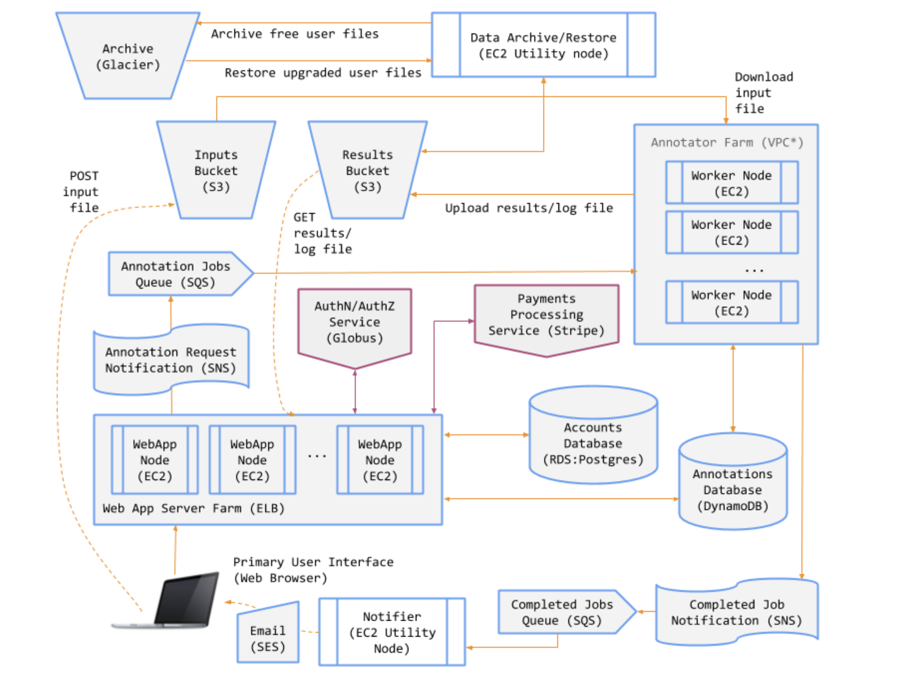
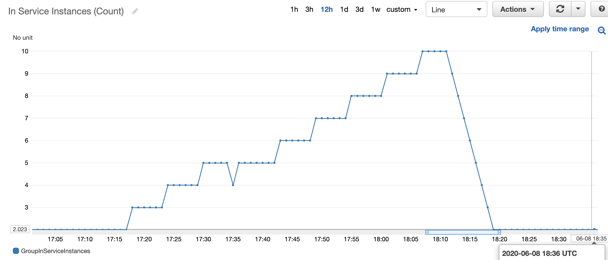
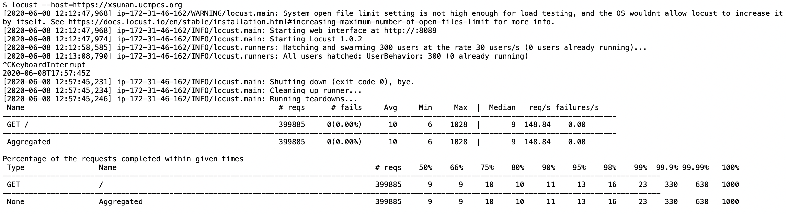
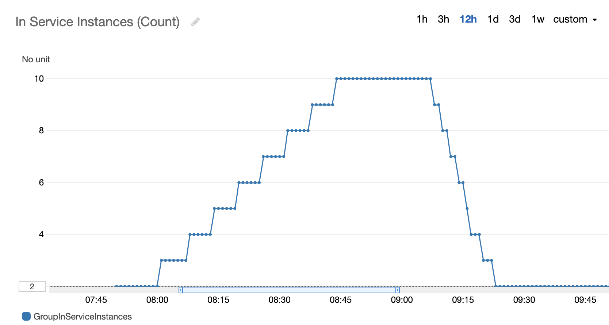

# Genomics Annotation Service 
A fully operational software-as-a-service for genomics analysis. Constructed of three parts: 

- Annotation Service: perform genomics analysis
  - a sequenced genome sample is analyzed to identify the locations of genes and all of the coding regions in a genome, and determine what those genes do 
- Web Services: user interface to interact with the system
  - request annotation job and upload input file
  - check job status and jobs list
  - check results forever for Premium users, within 3 days for Free users
  - Subscribe to premium users, update account information
- Util Services:
  - send email to users when the job is completed
  - archive the result files to Glacier when expired
  - restore the result files to S3 when subscrib to premium

Directory contents are as follows:

   - `/web` - The GAS web app files
   - `/ann` - Annotator files
   - `/util` - Utility scripts for notifications, archival, and restoration
   - `/aws` - AWS user data files

## Key Functions

​	\-  **Log in (via** **Globus Auth) to use the service** -- Some aspects of the service are available only to registered users. Two classes of users will be supported: Free and Premium. Premium users will have access to additional functionality, beyond that available to Free users. 

​	\-  **Upgrade from a Free to a Premium user** -- Premium users will be required to provide a credit card for payment of the service subscription. The GAS will integrate with Stripe (www.stripe.com) for credit card payment processing. No real credit cards are required for this project :-) ...we will use only a test credit card (4242424242424242) provided by Stripe. 

​	\-  **Submit an annotation job** -- Free users may only submit jobs of up to a certain size. Premium users may submit any size job. If a Free user submits an oversized job, the system will refuse it and will prompt the user to convert to a Premium user. 

​	\-  **Receive notifications when annotation jobs finish** -- When their annotation request is complete, the GAS will send users an email that includes a link where they can view the log file and download the results file. 

​	\-  **Browse jobs and download annotation results** -- The GAS will store annotation results for later retrieval. Users may view a list of their jobs (completed and running). Free users may download results up to 10 minutes after their job has completed; thereafter their results will be archived and only available to them if they convert to a Premium user. Premium users will always have all their data available for download. 

## System Components

The GAS will comprise the following components: 

   - An object store for input files, annotated (result) files, and job log files. 
   - A low cost, highly-durable object store for archiving the data of Free users. 
   - A key-value store for persisting information on annotation jobs. 
   - A relational database for user account information. 
   - A service that runs AnnTools for annotation. 
   - A web application for users to interact with the GAS. 
   - A set of message queues and notification topics for coordinating system activity. 
   - Two auto-scaling groups to dynamically scale the web and the annotation services

The diagram below shows the various GAS components/services and interactions:

* 

## Archive Process

1. Initiate a SNS topic xsunan_results_archive and in run.py publish a message when the job is completed
2. Initiate a SQS named: xsunan_results_archive which subscribe the sns topic xsunan_results_archive. And set the property: delivery delay to 5 minutes, so that the message will be released 5 minutes after the job is completed.
3. In archive.py, accept the message in xsunan_results_archive queue. When a message is received, it means that it was just completed 5 minutes ago. 
   1. Firstly, we need to check if the user is still a free user, in case the user has subscribed after the job is requested
   2. Right at this time, the result of this job should be archived to the Glacier, and the result file in S3 should be deleted, and the item in the dynamodb will be updated

## Restore Process

#### A.Restore

1. Initiate a SNS topic: xsunan_restore. When the user subsribe the premium (/subscribe), publish the message to the SNS topic
2. Initiate a SQS named xsunan_restore which subsribe the SNS topic xsunan_restore. In restore.py, long polling the messages from this queue. And once receive a message, start to restore all the result files of this user.
3. I add a variable in DynamoDB: existed. to indicate whether the result file has been obtained and upladed to S3. In restore.py, I set the exised variable to False.

#### B.Thaw

1. Initiate a SNS topic: xsunan_thaw. In step 2, when we restore the file, we will take the url of the topic-xsunan_thaw as a parameter, then when the restore job is completed, it will automatically public a message to the topic.
2. Initiate a SQS topic: xsunan_thaw which subsribes the SNS topic-xsunan_thaw. In thaw.py, long polling messages from the queue. 
3. Once a message is received, obtain the body of the object and upload it to S3. And update the exsisted variable to true

## Scalabiliry

Using Locust to conduct load testing. Simulating 30 users to continuously visit the website. Below shows the behavior of scaling out and scaling in.

### WEB server Automatic Scale: 

### Annotator server Automatic Scale: 

Using SNS and SQS services to simulate job requests. Below shows the behavior of scaling out and scaling in.

## References:

1. configParser: https://docs.python.org/3/library/configparser.html
2. delete queue message: https://boto3.amazonaws.com/v1/documentation/api/latest/reference/services/sqs.html#SQS.Client.delete_message
3. DynamoDB 
   1. query: https://boto3.amazonaws.com/v1/documentation/api/latest/guide/dynamodb.html#querying-and-scanning
   2. Update: https://boto3.amazonaws.com/v1/documentation/api/latest/reference/services/dynamodb.html#DynamoDB.Client.update_item
4. S3
   1. read object: https://boto3.amazonaws.com/v1/documentation/api/latest/reference/services/s3.html#S3.Object.get
   2. Get object:https://boto3.amazonaws.com/v1/documentation/api/latest/reference/services/s3.html#S3.Client.get_object
   3. delete object: https://boto3.amazonaws.com/v1/documentation/api/latest/reference/services/s3.html#S3.Client.delete_object
5. Glacier:
   1. upload object: https://boto3.amazonaws.com/v1/documentation/api/latest/reference/services/glacier.html#Glacier.Client.upload_archive
   2. initiate job: https://boto3.amazonaws.com/v1/documentation/api/latest/reference/services/glacier.html#Glacier.Client.initiate_job
6. SNS:
   1. publish: https://boto3.amazonaws.com/v1/documentation/api/latest/reference/services/sns.html#SNS.Topic.publish
7. SQS:
   1. https://boto3.amazonaws.com/v1/documentation/api/latest/reference/services/sqs.html#SQS.Client.receive_message
